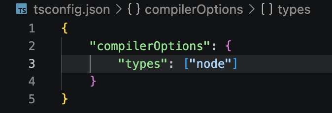
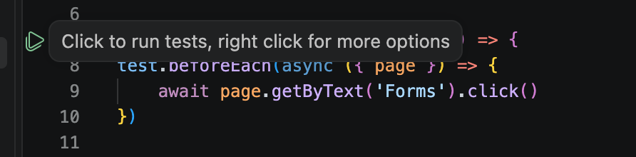

# These are my notes to refer to should I need help/prompts

### How to set up a playwright project

Create a folder in your finder window
Open it in VS Code
Open a terminal 
Type the following to initialise the project

```npm init playwright@latest```

This will create the basic project for you.

if you are using typescript, remember to end the file names with .ts
Also, you will need to create a tsconfig file

Create this at the root of the project and add the following in to it



### How to run tests in Playwright

This will show them running in the terminal

```npx playwright test```

You can also click on the green triangle next to the test in the test file 



You can run the tests in headed mode.  This is the command to run them.

```npx playwright test --headed```

You can run the tests in a specific browser in headed mode (or with --headed to run them without)

```npx playwright test --project=chromium --headed```

### When using Typescript, Promise is very important
- You need to add async to the test name and you need to await the page
- You also need to add page to the tests as that is the page you are using for all your tests

For example, you may create a before Each for your test to save duplicating on every test : 
```ts
test.beforeEach(async({page}) => {
    await page.goto('https://playground.bondaracademy.com/')
```


